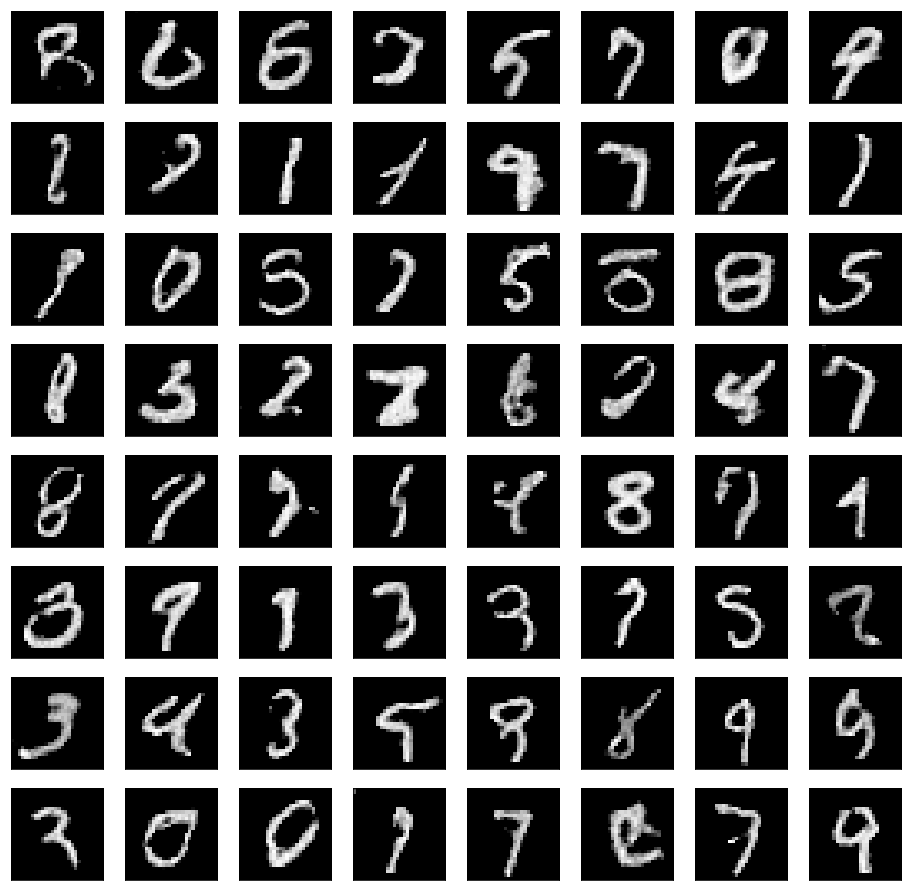

# Minimal DCGAN in TensorFlow
This is an implementation of a Deep Convolutional Generative Adversarial Network (DCGAN) in [TensorFlow](http://tensorflow.org). The example is based on the original work from [Radford et. al. ](https://arxiv.org/abs/1511.06434), where the generator learns to reconstruct samples from the [MNIST](http://yann.lecun.com/exdb/mnist/) dataset.

**Tested on:**  

- *macOS* - *CPU* - *Python 3.5* - *Tensorflow 1.1.0*
- *ubuntu xenial* - *GPU* - *Python 3.5* - *Tensorflow 1.1.0*

# Example Outputs
Digit generations are as following after *5000* and *20000* iterations:

